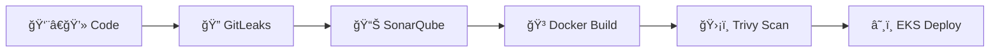

# 🛡️ 3-Tier-DevSecOps-Pipeline 

<div align="center">


**🚀 End-to-End DevSecOps Pipeline with Multi-Layer Security Scanning & Automated EKS Deployment**

</div>

---

## 🎯 Project Overview

**3-Tier-DevSecOps-Pipeline** is a complete enterprise-grade implementation showcasing security-first development practices. This project demonstrates how to build, secure, and deploy a full-stack application with automated vulnerability detection and zero-trust deployment strategies on AWS EKS.


### 🏗️ **3-Tier Architecture**

```
🌐 Frontend Layer    →    Node.js Express Application
⚙️ Backend Layer     →    RESTful API with Business Logic  
🗄️ Database Layer    →    MySQL with Encrypted Connections
```

## 🔒 **Security-First DevSecOps Pipeline**



### **🚨 Security Gates**
- **Pre-commit**: Secret detection with GitLeaks
- **Build-time**: Code quality analysis via SonarQube  
- **Container**: Vulnerability scanning using Trivy
- **Runtime**: Kubernetes security policies & network isolation

---

## 🚀 **Quick Start**

### **Prerequisites**
```bash
✅ AWS CLI configured
✅ Jenkins, Docker & kubectl installed  
✅ Node.js 23
```

### **1️⃣ Setup & Run**
```bash
# Clone repository
git clone https://github.com/namrqthakaipa/3Tier-DevSecOps-Project.git
cd 3Tier-DevSecOps-Project

# Install dependencies
cd api && npm install
cd ../client && npm install

# Start api server
cd api
npm start

# Start react server
cd client
npm start
```

### **2️⃣ EKS Deployment**
```bash
# 🔧 Complete EKS cluster setup guide
📖 Refer: eks_setup.md
```

## 🛠️ Infrastructure Setup

To provision the required infrastructure, refer to the repository below:  

[**Terraform-Provisioning Repository**](https://github.com/namrqthakaipa/Terraform-Provisioning.git)

### Steps to Set Up

```bash
# Clone the repository
git clone https://github.com/namrqthakaipa/Terraform-Provisioning.git

# Navigate to the project directory
cd Terraform-Provisioning

# Initialize Terraform
terraform init

# Preview planned changes
terraform plan

# Apply infrastructure changes
terraform apply
```


## 🤝 **Contributing**

1. Fork the repository
2. Create a feature branch
3. Run security scans locally
4. Submit a pull request

---

<div align="center">

**Connect with me:**

[](https://www.linkedin.com/in/namratha-kaipa-m/)
[](https://github.com/namrqthakaipa)

---

*🔒 Securing applications, one pipeline at a time | Built by Namratha Kaipa - DevSecOps Engineer*

</div>


